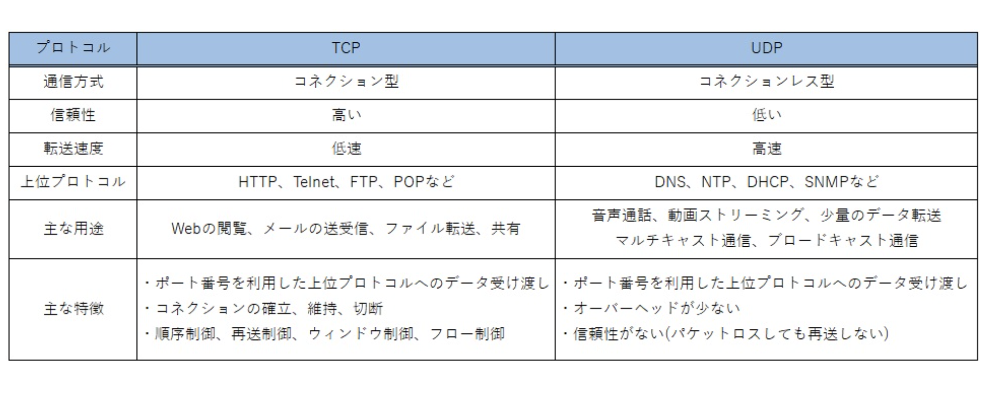

127.0.0.1 => ループバックアドレス
世界中のどのPCであっても自分自身のことを指す特別なIPアドレス
`ping -c 1 127.0.0.1` -> 自分自身のPCに向けて1回の通信テストをしてね！
だから、
送信元 : 127.0.0.1
受信先 : 172.0.0.1
になる。

Quarantの実行結果は、
`{"type":"packet_observed","src_ip":"127.0.0.1","dst_ip":"127.0.0.1","protocol":"ICMPv4","message":"2026-06-20 09:33:15.863392 +0000 UTC"}`
これになった。
protocolが、ICMPv4になった理由は、
`ping` コマンドが、ICMPという特殊なプロトコルを利用しているから。
ICMPは、ネットワークの疎通確認(生存確認)専用のプロトコル

---

`python3 -m http.server 8080`
Pythonの機能を利用して、自分のPC上で、8080番の簡易ウェブサーバーを起動
`sudo tcpdump -i lo0 -c 1 -w sample/test.pcap 'tcp port 8080'`

--- 
### UDPとTCPの違い
TCPは高信頼
UDPはコネクションレスなので、少し信頼にかける
でも、高速で行うことができる

---
### TCPフラグとは
https://zenn.dev/tanimoto915/articles/6d052abdba733c
パケットの内容を示すTCPヘッダ内の6ビットのフィールド

今回は、以下の４つを導入した。
・SYN：接続要求　接続開始時に挨拶をするときに利用される(synchronize)
・ACK: 確認応答　あなたのメッセージを受け取りましたというのを示す (Acknowledgement)
・FIN: 送信終了　もう送るデータがありませんという意思表示 (finish)
・RST: 強制切断　接続状態がおかしいので、直ちに通信を破棄しますという緊急停止 (reset)

---
### helper関数とは
特定のメイン関数をサポートwするために繰り返し使われる共通処理を切り出した補助的な関数のこと

---
### なぜisPrivateIP関数がプライベートIPなのかどうかを判断できるのか？
プライベートIPアドレスは、
クラスA: 10.0.0.0 〜 10.255.255.255（頭が 10）
クラスB: 172.16.0.0 〜 172.31.255.255（頭が 172 で、次が 16 〜 31）
クラスC: 192.168.0.0 〜 192.168.255.255（頭が 192.168）
のどれかという決まりがある

だから、それをチェックすることで、プライベートかどうかを判断することができる。

---
src: 送信元
dst: 受信先
自分が常にsrcとは限らない

googleのサイトを見ようとして、リクエストを送るときは、

outbound
srcip: 192.168.1.20
dstip: 8.8.8.8

inbound
srcip: 8.8.8.8
dstip: 192.168.1.20

---
プロトコルとサービスは何が違うのか
プロトコル：TCP/UDP (配達業者・どうやって運ぶか)
TCP：荷物が届いたかを毎回確認して、順番通りにカチッと届ける
UDP：届くかどうかは保証しないから、とにかく早く次々に送りつける

サービス：HTTP/DNSとか(荷物の中身・何のために通信をするか)
HTTP/HTTPS: ウェブサイトを閲覧したいという用事
SSH: サーバーを遠隔操作したいという用事
DNS: 土面名のIPアドレスを教えて欲しいという用事

だからコード上ではprotocolをチェックした上で、その中身であるserviceの確認を行なっている。

---
DNSとは：Domain Name System
IPアドレスを人間が扱いやすいようにドメイン名に変えくれるシステム

DNSクエリ：DNSサーバーに情報を問い合わせること
 PCとDNSサーバーの間でパケットを投げ合ってやりとりをしている。
 そのパケットの中にQuestionという専門のメモ欄があって、そこにgoogl.comもIPアドレスを教えてください！という書き込みがある。
 だから、今回は覗き見をして、ドメイン名を引っこ抜いている。

 暗号化されていないときは、普通にドメイン名を見ることができる。
 されているときについては後で考えよう...　

 DNSのタイプ
 今回は今回のDNSの質問はドメイン内の何の情報を知りたがっているパケットなのかを文字として記録している

"A" : このドメインのIPv4アドレスを教えて！
"AAAA" : このドメインのIPv6アドレスを教えて！
"CNAME" : このドメインの別名を教えて！  -> 例exsample.comの本当の名前はserver-01.main-hosting.comです　みたいにドメインを別のドメイン名にリンクするときに利用されている。
"MX" : このドメインのメールサーバはどこ？という質問

---
なんで「Dst IP」と、「DNS応答のIPアドレスをとっているのか」
1. 悪意のある通信（偽物）を見抜くため
もしもPCがウイルスに乗っ取られていたとして、そのウイルスが、悪意のあるサーバーのIPアドレスに直接データを送り始めたとする。
もしも両方チェックしていたら、
IP DNSサーバーから帰ってきた正しいIPアドレスのリストの中に載っていないぞ？？怪しい！！となる。

2. 大手サイトは、一つのドメインに対しても3, 4このIPアドレスを持っているから、DNSがその瞬間に返したIPのリストを正確にとっておかないと、後から流れてきたパケットを見た時に、このIPアドレスって、さっき帰ってきた３つのうちどれだっけ...??怪しいものか？？となる。

まあ、正しいIPかどうかのダブルチェック用って理解でおkかな？？